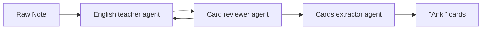

# English Flashcard Generator (Python AG2 Implementation)

This project is a Python implementation of an AI-enhanced English flashcard generator using the AG2 framework. 
It processes markdown notes from English lessons and generates flashcards to help with memorization.

## Overview

This project is a trying out of the Loop Agentic AI pattern:


The project has started with .Net version of the Autogen framework, which has been suspended.
After that the python version of the AG2 framework has been created, which is a port of the .Net version.
The python version itself is a try of agentic code editing.


The English Flashcard Generator:

1. Reads markdown notes from a source file
2. Processes these notes using a group of specialized AI agents in a finite state machine pattern:
   - **TeacherAgent**: Analyzes notes and creates flashcards
   - **ReviewerAgent**: Reviews flashcards for quality and correctness, providing feedback
   - **ExtractorAgent**: Formats approved flashcards into JSON format
3. Generates flashcards in a structured format
4. Saves both the flashcards and processed notes to output files

The agents communicate with each other in a controlled workflow:
- The TeacherAgent creates initial flashcards from the notes
- The ReviewerAgent evaluates the flashcards and either approves them or sends them back to the TeacherAgent for revision
- Once approved, the ExtractorAgent formats the flashcards into a structured JSON format
- The system then converts the JSON to the expected format and saves the output files

## Features

- Finite state machine approach for controlled agent communication
- Interactive agent collaboration with feedback loops
- Support for multiple LLM providers (OpenAI, Azure, OpenRouter)
- Configurable agent parameters (temperature, max tokens)
- Customizable file paths and templates
- Comprehensive error handling and retry logic
- Asynchronous processing for efficiency

## Requirements

- Python 3.8+
- AG2 (PyAutoGen) library
- OpenAI API key or Azure OpenAI API key

## Installation

1. Clone the repository:
   ```
   git clone https://github.com/V0v1kkk/EnglishFlashcardGenerator.git
   cd EnglishFlashcardGenerator
   ```

2. Install the required packages:
   ```
   pip install -r requirements.txt
   ```

3. Copy the template configuration file and update it with your API keys:
   ```
   cp appsettings.template.json appsettings.json
   ```

## Configuration

Edit the `appsettings.json` file to configure:

1. **FilePaths**: Paths to source notes, output folders, and templates
2. **Providers**: LLM provider configurations (OpenAI, Azure, OpenRouter)
3. **Agents**: Agent-specific settings (provider, temperature, max tokens)

Example configuration:
```json
{
  "FilePaths": {
    "SourceNotePath": "/path/to/your/notes.md",
    "ResultCardsFolderPath": "/path/to/your/flashcards/folder/",
    "ResultNotesFolderPath": "/path/to/your/notes/folder/",
    "CardTemplatePath": "cardTemplate.md",
    "NoteTemplatePath": "noteTemplate.md"
  },
  "Providers": [
    {
      "Name": "Default",
      "Type": "OpenAI",
      "OpenAI": {
        "ApiKey": "your-openai-api-key",
        "ModelName": "gpt-4o-2024-08-06"
      }
    }
  ],
  "Agents": {
    "TeacherAgent": {
      "ProviderName": "Default",
      "Temperature": 0.7,
      "MaxTokens": 16384
    },
    "ReviewerAgent": {
      "ProviderName": "Default",
      "Temperature": 1.0,
      "MaxTokens": 16384
    },
    "ExtractorAgent": {
      "ProviderName": "Default",
      "Temperature": 0.2,
      "MaxTokens": 16384
    }
  }
}
```

## Usage

Run the program:
```
python main.py
```

The program will:
1. Read the source markdown file
2. Process each section using the agent group chat with a finite state machine approach:
   - The TeacherAgent creates initial flashcards from the notes
   - The ReviewerAgent evaluates the flashcards and provides feedback
   - If the ReviewerAgent approves the flashcards (by saying "OK!"), they are sent to the ExtractorAgent
   - If the ReviewerAgent has suggestions, the flashcards are sent back to the TeacherAgent for revision
   - The ExtractorAgent formats the approved flashcards into JSON
   - The conversation terminates automatically after the ExtractorAgent completes its work
3. Save the generated flashcards and notes to the specified output folders

The agent interaction is controlled by a custom speaker selection function that determines which agent should speak next based on the current state of the conversation.

## Input Format

The source markdown file should contain sections separated by second-level headers (`## `). Each section should start with a date in one of the following formats:
- `[[yyyy-MM-dd-DayOfWeek|dd.MM.yyyy]]`
- `[[yyyy-MM-dd-DayOfWeek]]`
- `dd.MM.yyyy`

## Output Format

The program generates two types of output files:

1. **Flashcard files**: Markdown files containing the generated flashcards
2. **Note files**: Markdown files containing the processed notes

## Project Structure

```
EnglishFlashcardGenerator/
├── main.py                     # Main entry point
├── appsettings.json            # Configuration file
├── appsettings.template.json   # Template configuration file
├── cardTemplate.md             # Template for flashcard output
├── noteTemplate.md             # Template for note output
├── data_classes.py             # FlashCard and related classes
├── flashcard_helper.py         # Flashcard formatting utilities
├── note_tools.py               # Note parsing utilities
├── agents/
│   ├── agent_base.py           # Base agent class
│   ├── english_teacher_agent.py # English teacher agent
│   ├── flashcard_reviewer_agent.py # Flashcard reviewer agent
│   └── flashcard_extractor_agent.py # Flashcard extractor agent
└── config/
    └── config_loader.py        # Configuration loading utilities
```

## License

This project is licensed under the MIT License - see the LICENSE file for details.

## Acknowledgments

This project is a Python port of a .NET implementation using the AG2 framework.